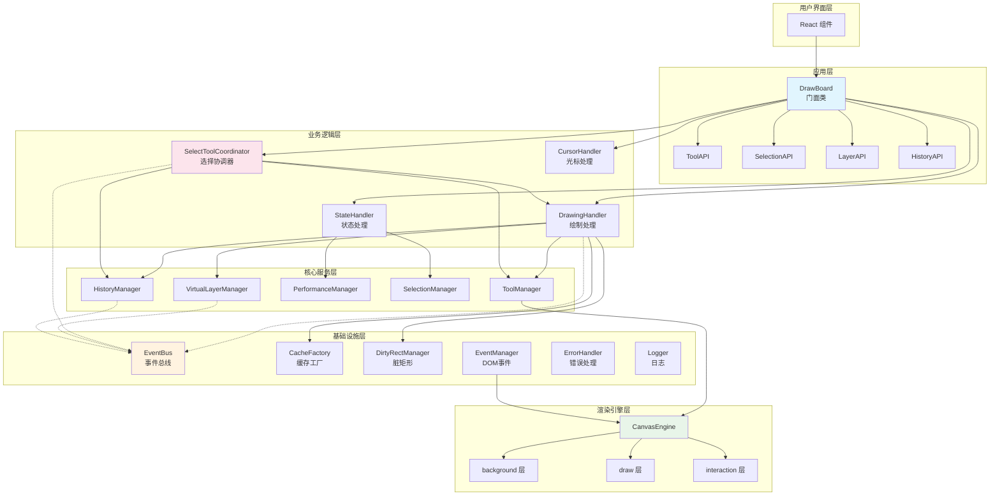
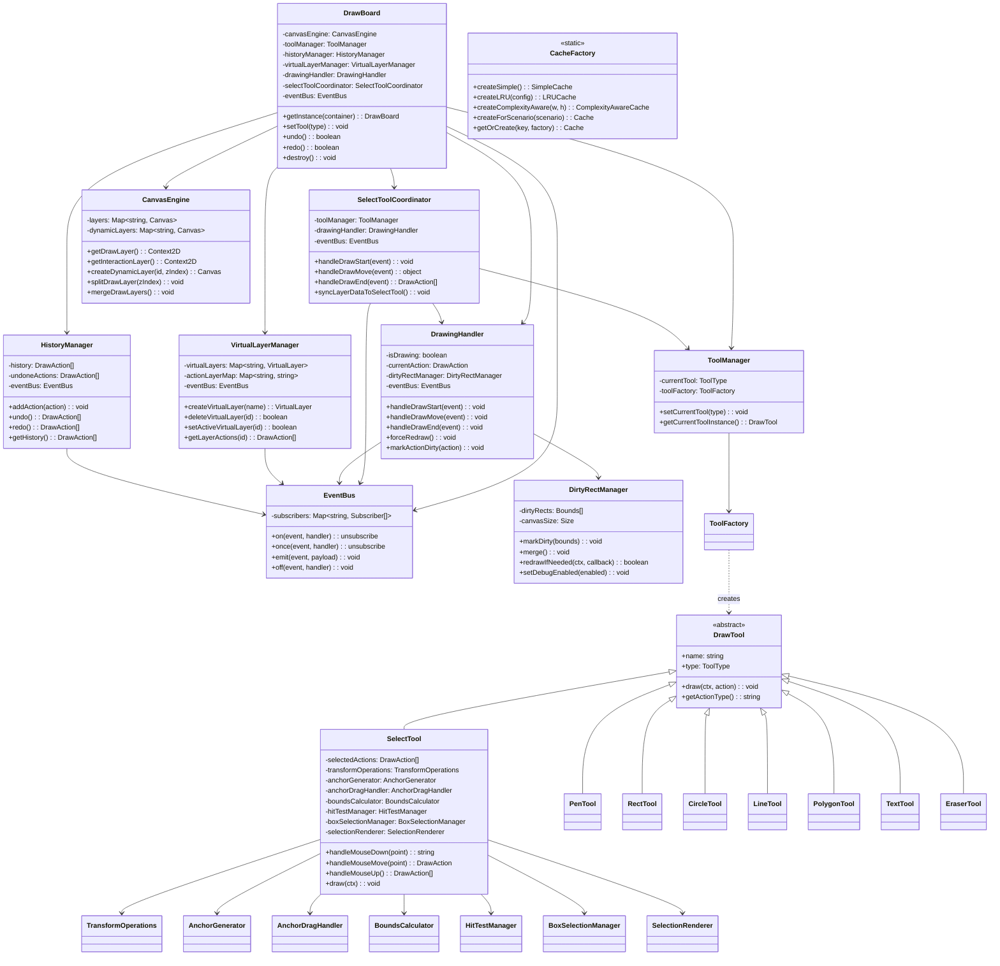
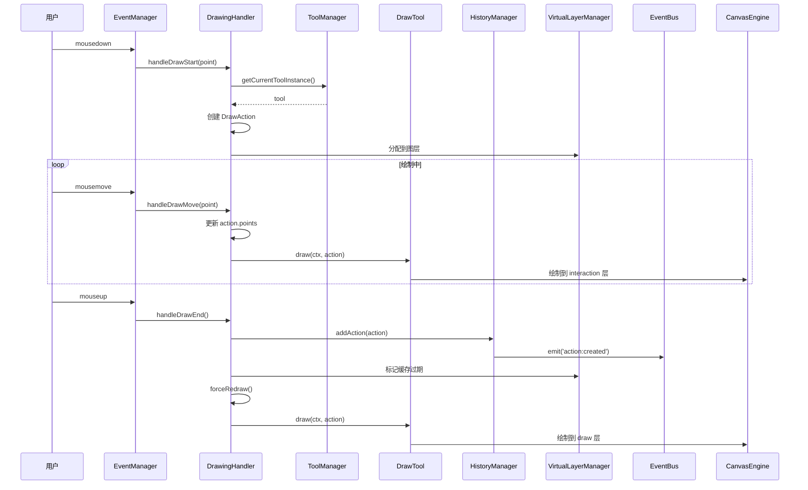
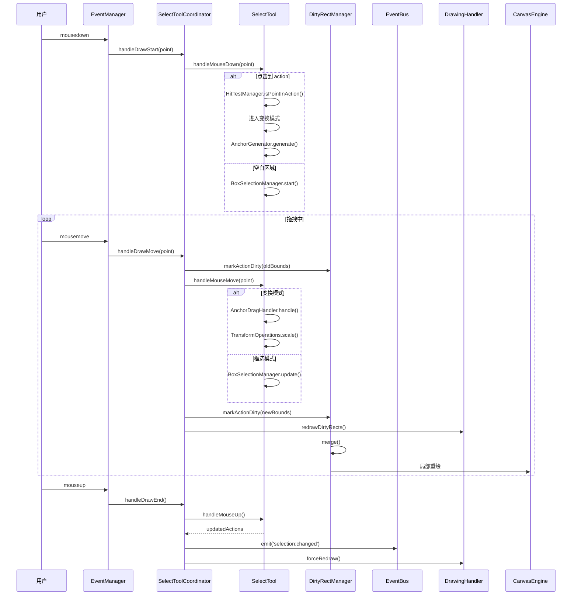
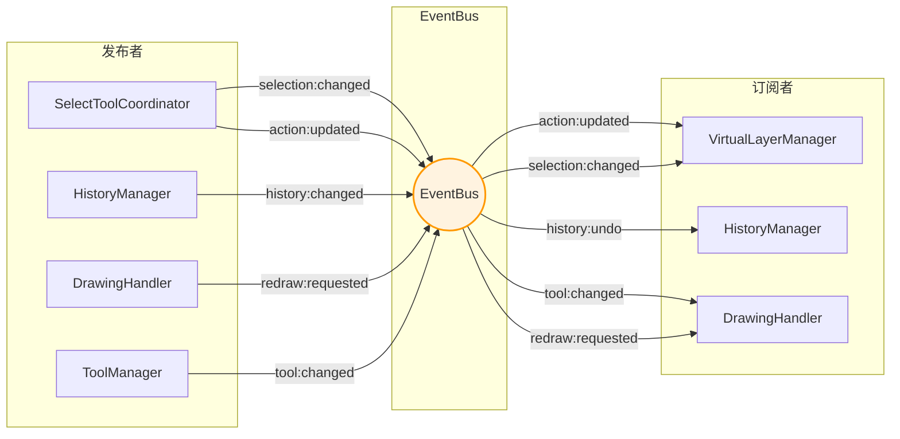
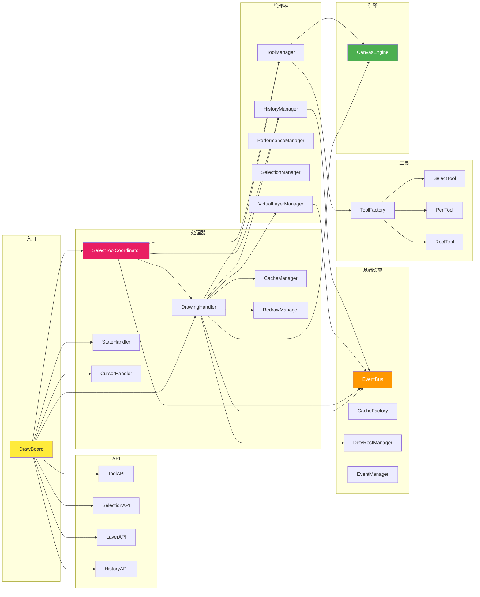
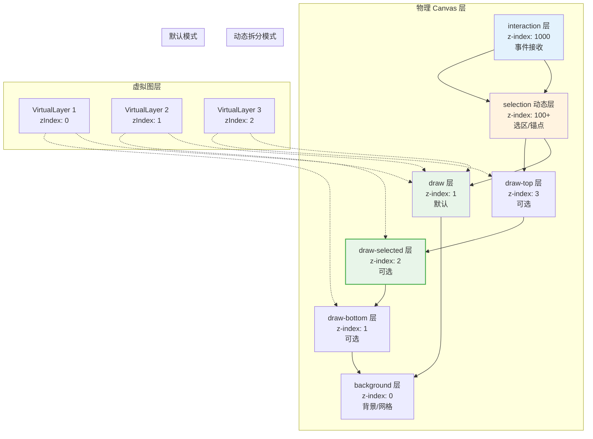
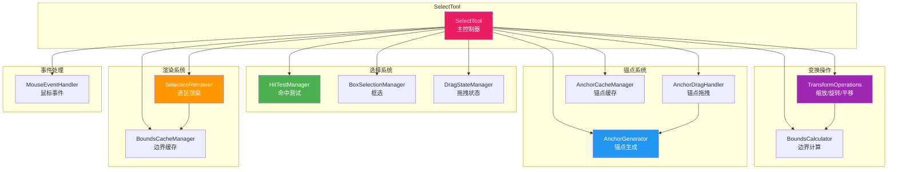
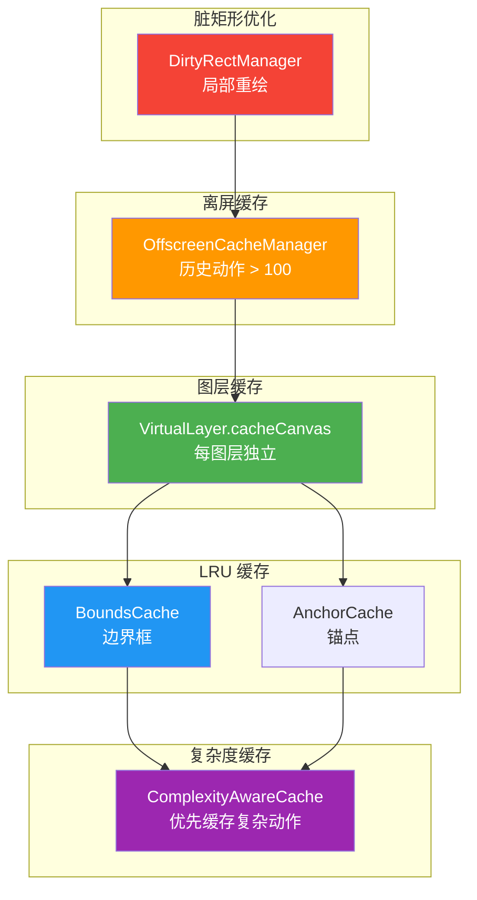

# 📐 DrawBoard UML 设计图

## 1. 整体架构图

---

## 2. 核心类图

---

## 3. 绘制时序图

---

## 4. 选择工具时序图（含脏矩形优化）

---

## 5. EventBus 事件流图

---

## 6. 模块依赖图

---

## 7. 图层结构图

---

## 8. SelectTool 子模块架构

---

## 9. 设计模式应用

```mermaid
graph TB
    subgraph "门面模式"
        F1[DrawBoard] --> F2[简化 API]
    end
    
    subgraph "工厂模式"
        FA1[ToolFactory] --> FA2[createTool]
        FA3[CacheFactory] --> FA4[createForScenario]
    end
    
    subgraph "观察者模式"
        O1[EventBus] --> O2[on/emit]
        O3[EventManager] --> O4[DOM事件]
    end
    
    subgraph "命令模式"
        C1[HistoryManager] --> C2[DrawAction]
        C2 --> C3[undo/redo]
    end
    
    subgraph "策略模式"
        S1[ToolManager] --> S2[setCurrentTool]
        S2 --> S3[不同绘制策略]
    end
    
    subgraph "协调器模式"
        CO1[SelectToolCoordinator] --> CO2[协调多组件]
    end
    
    style F1 fill:#e1f5fe
    style FA1 fill:#f3e5f5
    style FA3 fill:#f3e5f5
    style O1 fill:#fff3e0
    style O3 fill:#e8f5e9
    style C1 fill:#fff3e0
    style S1 fill:#fce4ec
    style CO1 fill:#e91e63,color:#fff
```

---

## 10. 缓存层级图

---

**文档版本**: 4.0  
**最后更新**: 2024-12  
**主要更新**:
- 新增 EventBus 事件总线图
- 新增 SelectToolCoordinator 协调器
- 新增脏矩形优化时序图
- 新增 SelectTool 子模块架构图
- 新增缓存层级图
- 更新类图包含新组件
