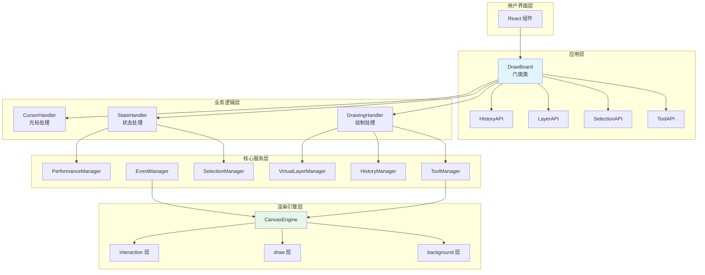
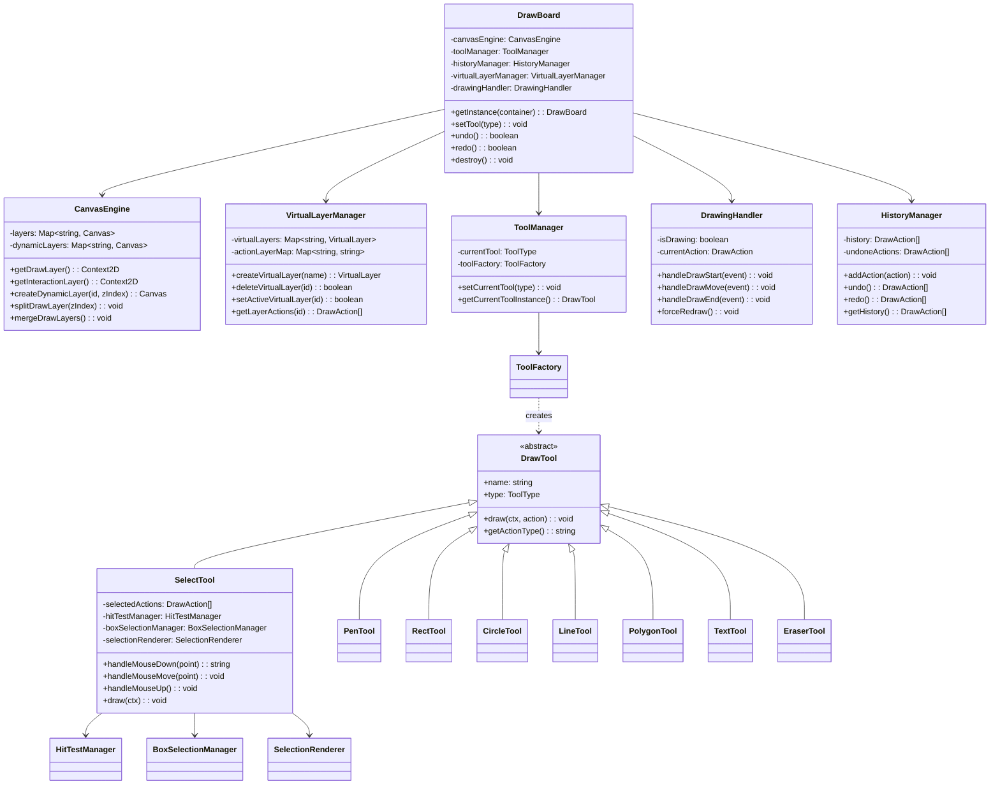
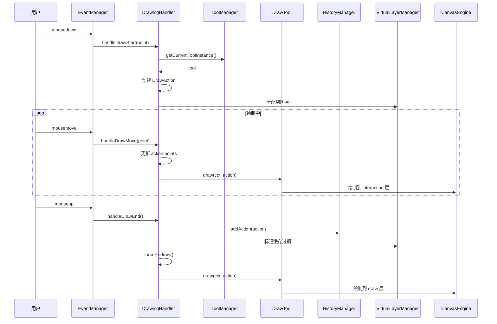
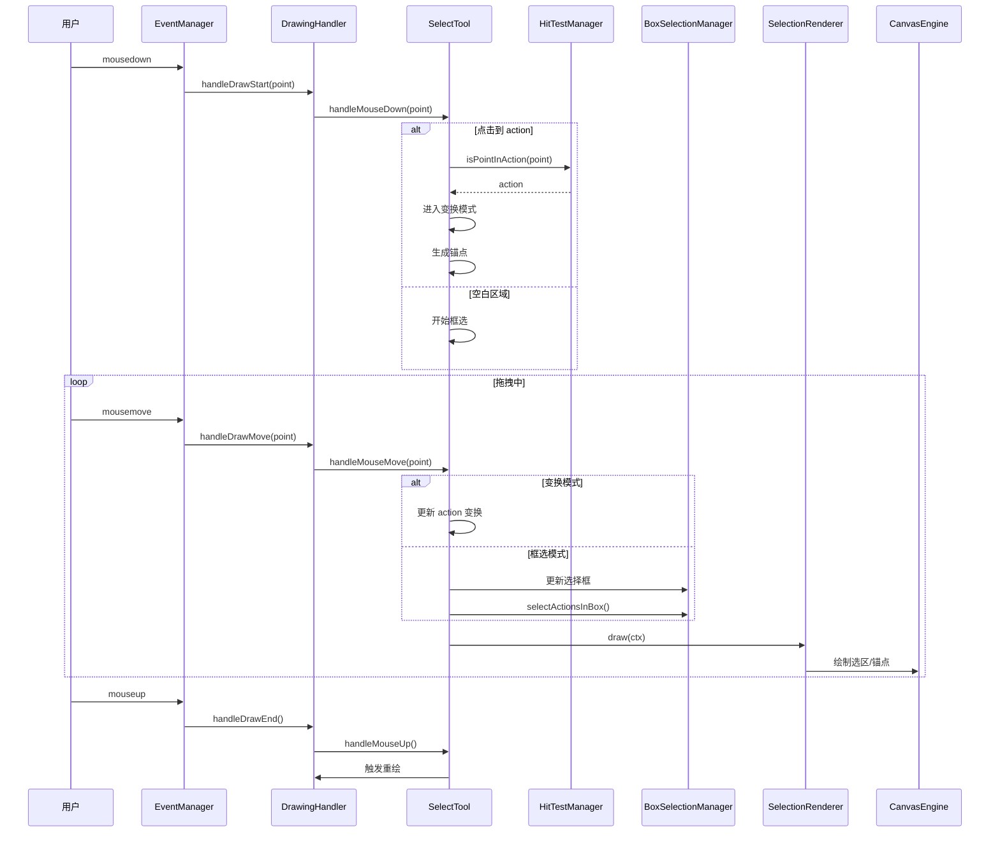
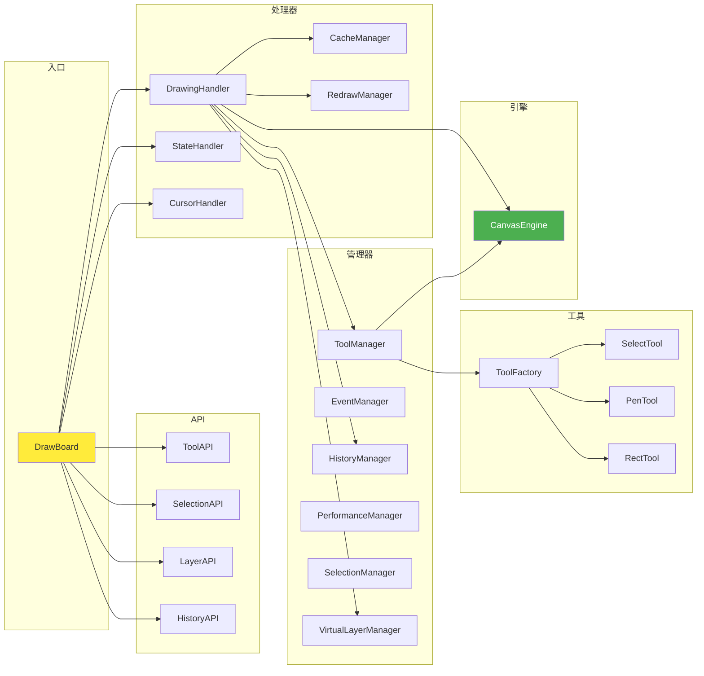
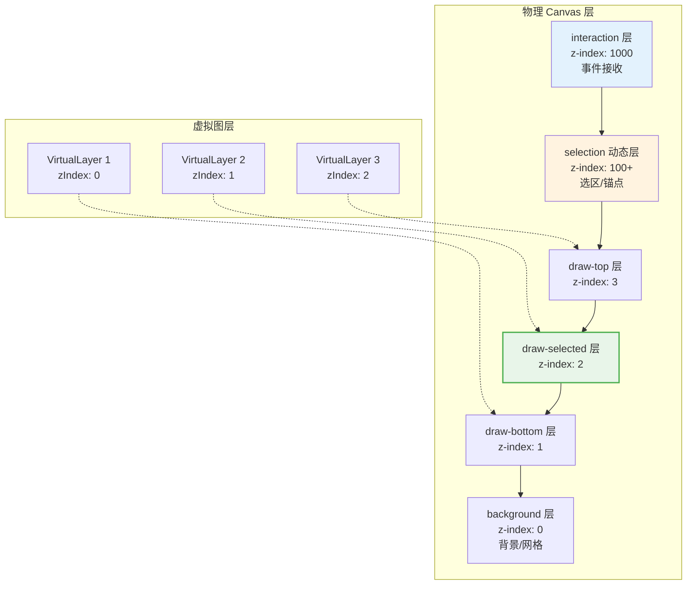
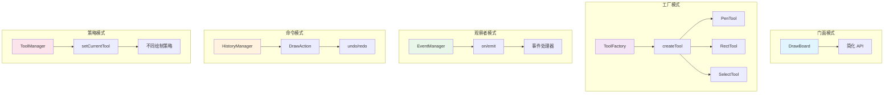

# 📐 DrawBoard UML 设计图

## 1. 整体架构图

```mermaid
graph TB
    subgraph "用户界面层"
        UI[React 组件]
    end
    
    subgraph "应用层"
        DB[DrawBoard<br/>门面类]
        API1[ToolAPI]
        API2[SelectionAPI]
        API3[LayerAPI]
        API4[HistoryAPI]
    end
    
    subgraph "业务逻辑层"
        DH[DrawingHandler<br/>绘制处理]
        SH[StateHandler<br/>状态处理]
        CH[CursorHandler<br/>光标处理]
    end
    
    subgraph "核心服务层"
        TM[ToolManager]
        EM[EventManager]
        HM[HistoryManager]
        PM[PerformanceManager]
        SM[SelectionManager]
        VLM[VirtualLayerManager]
    end
    
    subgraph "渲染引擎层"
        CE[CanvasEngine]
        BG[background 层]
        DR[draw 层]
        IT[interaction 层]
    end
    
    UI --> DB
    DB --> API1 & API2 & API3 & API4
    DB --> DH & SH & CH
    DH --> TM & HM & VLM
    SH --> SM & PM
    TM & EM --> CE
    CE --> BG & DR & IT
    
    style DB fill:#e1f5fe
    style CE fill:#e8f5e9
```

---

## 2. 核心类图

```mermaid
classDiagram
    class DrawBoard {
        -canvasEngine: CanvasEngine
        -toolManager: ToolManager
        -historyManager: HistoryManager
        -virtualLayerManager: VirtualLayerManager
        -drawingHandler: DrawingHandler
        +getInstance(container): DrawBoard
        +setTool(type): void
        +undo(): boolean
        +redo(): boolean
        +destroy(): void
    }
    
    class CanvasEngine {
        -layers: Map~string, Canvas~
        -dynamicLayers: Map~string, Canvas~
        +getDrawLayer(): Context2D
        +getInteractionLayer(): Context2D
        +createDynamicLayer(id, zIndex): Canvas
        +splitDrawLayer(zIndex): void
        +mergeDrawLayers(): void
    }
    
    class VirtualLayerManager {
        -virtualLayers: Map~string, VirtualLayer~
        -actionLayerMap: Map~string, string~
        +createVirtualLayer(name): VirtualLayer
        +deleteVirtualLayer(id): boolean
        +setActiveVirtualLayer(id): boolean
        +getLayerActions(id): DrawAction[]
    }
    
    class ToolManager {
        -currentTool: ToolType
        -toolFactory: ToolFactory
        +setCurrentTool(type): void
        +getCurrentToolInstance(): DrawTool
    }
    
    class DrawTool {
        <<abstract>>
        +name: string
        +type: ToolType
        +draw(ctx, action): void
        +getActionType(): string
    }
    
    class SelectTool {
        -selectedActions: DrawAction[]
        -hitTestManager: HitTestManager
        -boxSelectionManager: BoxSelectionManager
        -selectionRenderer: SelectionRenderer
        +handleMouseDown(point): string
        +handleMouseMove(point): void
        +handleMouseUp(): void
        +draw(ctx): void
    }
    
    class DrawingHandler {
        -isDrawing: boolean
        -currentAction: DrawAction
        +handleDrawStart(event): void
        +handleDrawMove(event): void
        +handleDrawEnd(event): void
        +forceRedraw(): void
    }
    
    class HistoryManager {
        -history: DrawAction[]
        -undoneActions: DrawAction[]
        +addAction(action): void
        +undo(): DrawAction[]
        +redo(): DrawAction[]
        +getHistory(): DrawAction[]
    }
    
    DrawBoard --> CanvasEngine
    DrawBoard --> ToolManager
    DrawBoard --> HistoryManager
    DrawBoard --> VirtualLayerManager
    DrawBoard --> DrawingHandler
    
    ToolManager --> ToolFactory
    ToolFactory ..> DrawTool : creates
    
    DrawTool <|-- SelectTool
    DrawTool <|-- PenTool
    DrawTool <|-- RectTool
    DrawTool <|-- CircleTool
    DrawTool <|-- LineTool
    DrawTool <|-- PolygonTool
    DrawTool <|-- TextTool
    DrawTool <|-- EraserTool
    
    SelectTool --> HitTestManager
    SelectTool --> BoxSelectionManager
    SelectTool --> SelectionRenderer
```

---

## 3. 绘制时序图

```mermaid
sequenceDiagram
    participant U as 用户
    participant EM as EventManager
    participant DH as DrawingHandler
    participant TM as ToolManager
    participant Tool as DrawTool
    participant HM as HistoryManager
    participant VLM as VirtualLayerManager
    participant CE as CanvasEngine
    
    U->>EM: mousedown
    EM->>DH: handleDrawStart(point)
    DH->>TM: getCurrentToolInstance()
    TM-->>DH: tool
    DH->>DH: 创建 DrawAction
    DH->>VLM: 分配到图层
    
    loop 绘制中
        U->>EM: mousemove
        EM->>DH: handleDrawMove(point)
        DH->>DH: 更新 action.points
        DH->>Tool: draw(ctx, action)
        Tool->>CE: 绘制到 interaction 层
    end
    
    U->>EM: mouseup
    EM->>DH: handleDrawEnd()
    DH->>HM: addAction(action)
    DH->>VLM: 标记缓存过期
    DH->>DH: forceRedraw()
    DH->>Tool: draw(ctx, action)
    Tool->>CE: 绘制到 draw 层
```

---

## 4. 选择时序图

```mermaid
sequenceDiagram
    participant U as 用户
    participant EM as EventManager
    participant DH as DrawingHandler
    participant ST as SelectTool
    participant HTM as HitTestManager
    participant BSM as BoxSelectionManager
    participant SR as SelectionRenderer
    participant CE as CanvasEngine
    
    U->>EM: mousedown
    EM->>DH: handleDrawStart(point)
    DH->>ST: handleMouseDown(point)
    
    alt 点击到 action
        ST->>HTM: isPointInAction(point)
        HTM-->>ST: action
        ST->>ST: 进入变换模式
        ST->>ST: 生成锚点
    else 空白区域
        ST->>ST: 开始框选
    end
    
    loop 拖拽中
        U->>EM: mousemove
        EM->>DH: handleDrawMove(point)
        DH->>ST: handleMouseMove(point)
        
        alt 变换模式
            ST->>ST: 更新 action 变换
        else 框选模式
            ST->>BSM: 更新选择框
            ST->>BSM: selectActionsInBox()
        end
        
        ST->>SR: draw(ctx)
        SR->>CE: 绘制选区/锚点
    end
    
    U->>EM: mouseup
    EM->>DH: handleDrawEnd()
    DH->>ST: handleMouseUp()
    ST->>DH: 触发重绘
```

---

## 5. 模块依赖图

```mermaid
graph LR
    subgraph "入口"
        DB[DrawBoard]
    end
    
    subgraph "API"
        TA[ToolAPI]
        SA[SelectionAPI]
        LA[LayerAPI]
        HA[HistoryAPI]
    end
    
    subgraph "处理器"
        DH[DrawingHandler]
        SH[StateHandler]
        CH[CursorHandler]
        CM[CacheManager]
        RM[RedrawManager]
    end
    
    subgraph "管理器"
        TM[ToolManager]
        EM[EventManager]
        HM[HistoryManager]
        PM[PerformanceManager]
        SM[SelectionManager]
        VLM[VirtualLayerManager]
    end
    
    subgraph "工具"
        TF[ToolFactory]
        ST[SelectTool]
        PT[PenTool]
        RT[RectTool]
    end
    
    subgraph "引擎"
        CE[CanvasEngine]
    end
    
    DB --> TA & SA & LA & HA
    DB --> DH & SH & CH
    DH --> TM & HM & VLM & CM & RM
    TM --> TF
    TF --> ST & PT & RT
    DH & TM --> CE
    
    style DB fill:#ffeb3b
    style CE fill:#4caf50,color:#fff
```

---

## 6. 图层结构图

```mermaid
graph TB
    subgraph "物理 Canvas 层"
        IT[interaction 层<br/>z-index: 1000<br/>事件接收]
        SL[selection 动态层<br/>z-index: 100+<br/>选区/锚点]
        DT[draw-top 层<br/>z-index: 3]
        DS[draw-selected 层<br/>z-index: 2]
        DB[draw-bottom 层<br/>z-index: 1]
        BG[background 层<br/>z-index: 0<br/>背景/网格]
    end
    
    subgraph "虚拟图层"
        VL1[VirtualLayer 1<br/>zIndex: 0]
        VL2[VirtualLayer 2<br/>zIndex: 1]
        VL3[VirtualLayer 3<br/>zIndex: 2]
    end
    
    VL1 -.-> DB
    VL2 -.-> DS
    VL3 -.-> DT
    
    IT --> SL --> DT --> DS --> DB --> BG
    
    style IT fill:#e3f2fd
    style SL fill:#fff3e0
    style DS fill:#e8f5e9,stroke:#4caf50,stroke-width:2px
```

---

## 7. 设计模式应用

```mermaid
graph TB
    subgraph "门面模式"
        F1[DrawBoard] --> F2[简化 API]
    end
    
    subgraph "工厂模式"
        FA1[ToolFactory] --> FA2[createTool]
        FA2 --> FA3[PenTool]
        FA2 --> FA4[RectTool]
        FA2 --> FA5[SelectTool]
    end
    
    subgraph "观察者模式"
        O1[EventManager] --> O2[on/emit]
        O2 --> O3[事件处理器]
    end
    
    subgraph "命令模式"
        C1[HistoryManager] --> C2[DrawAction]
        C2 --> C3[undo/redo]
    end
    
    subgraph "策略模式"
        S1[ToolManager] --> S2[setCurrentTool]
        S2 --> S3[不同绘制策略]
    end
    
    style F1 fill:#e1f5fe
    style FA1 fill:#f3e5f5
    style O1 fill:#e8f5e9
    style C1 fill:#fff3e0
    style S1 fill:#fce4ec
```

---

**文档版本**: 3.0  
**最后更新**: 2024-12

