# 📐 DrawBoard UML 设计图

## 1. 整体架构图

```mermaid
graph TB
    subgraph "用户界面层"
        UI[React 组件]
    end
    
    subgraph "应用层"
        DB[DrawBoard<br/>门面类]
        API1[ToolAPI]
        API2[SelectionAPI]
        API3[LayerAPI]
        API4[HistoryAPI]
    end
    
    subgraph "业务逻辑层"
        DH[DrawingHandler<br/>绘制处理]
        SH[StateHandler<br/>状态处理]
        CH[CursorHandler<br/>光标处理]
    end
    
    subgraph "核心服务层"
        TM[ToolManager]
        EM[EventManager]
        HM[HistoryManager]
        PM[PerformanceManager]
        SM[SelectionManager]
        VLM[VirtualLayerManager]
    end
    
    subgraph "渲染引擎层"
        CE[CanvasEngine]
        BG[background 层]
        DR[draw 层]
        IT[interaction 层]
    end
    
    UI --> DB
    DB --> API1 & API2 & API3 & API4
    DB --> DH & SH & CH
    DH --> TM & HM & VLM
    SH --> SM & PM
    TM & EM --> CE
    CE --> BG & DR & IT
    
    style DB fill:#e1f5fe
    style CE fill:#e8f5e9
```

---

## 2. 核心类图

---

## 3. 绘制时序图

```mermaid
sequenceDiagram
    participant U as 用户
    participant EM as EventManager
    participant DH as DrawingHandler
    participant TM as ToolManager
    participant Tool as DrawTool
    participant HM as HistoryManager
    participant VLM as VirtualLayerManager
    participant CE as CanvasEngine
    
    U->>EM: mousedown
    EM->>DH: handleDrawStart(point)
    DH->>TM: getCurrentToolInstance()
    TM-->>DH: tool
    DH->>DH: 创建 DrawAction
    DH->>VLM: 分配到图层
    
    loop 绘制中
        U->>EM: mousemove
        EM->>DH: handleDrawMove(point)
        DH->>DH: 更新 action.points
        DH->>Tool: draw(ctx, action)
        Tool->>CE: 绘制到 interaction 层
    end
    
    U->>EM: mouseup
    EM->>DH: handleDrawEnd()
    DH->>HM: addAction(action)
    DH->>VLM: 标记缓存过期
    DH->>DH: forceRedraw()
    DH->>Tool: draw(ctx, action)
    Tool->>CE: 绘制到 draw 层
```

---

## 4. 选择时序图

```mermaid
sequenceDiagram
    participant U as 用户
    participant EM as EventManager
    participant DH as DrawingHandler
    participant ST as SelectTool
    participant HTM as HitTestManager
    participant BSM as BoxSelectionManager
    participant SR as SelectionRenderer
    participant CE as CanvasEngine
    
    U->>EM: mousedown
    EM->>DH: handleDrawStart(point)
    DH->>ST: handleMouseDown(point)
    
    alt 点击到 action
        ST->>HTM: isPointInAction(point)
        HTM-->>ST: action
        ST->>ST: 进入变换模式
        ST->>ST: 生成锚点
    else 空白区域
        ST->>ST: 开始框选
    end
    
    loop 拖拽中
        U->>EM: mousemove
        EM->>DH: handleDrawMove(point)
        DH->>ST: handleMouseMove(point)
        
        alt 变换模式
            ST->>ST: 更新 action 变换
        else 框选模式
            ST->>BSM: 更新选择框
            ST->>BSM: selectActionsInBox()
        end
        
        ST->>SR: draw(ctx)
        SR->>CE: 绘制选区/锚点
    end
    
    U->>EM: mouseup
    EM->>DH: handleDrawEnd()
    DH->>ST: handleMouseUp()
    ST->>DH: 触发重绘
```

---

## 5. 模块依赖图

---

## 6. 图层结构图

```mermaid
graph TB
    subgraph "物理 Canvas 层"
        IT[interaction 层<br/>z-index: 1000<br/>事件接收]
        SL[selection 动态层<br/>z-index: 100+<br/>选区/锚点]
        DT[draw-top 层<br/>z-index: 3]
        DS[draw-selected 层<br/>z-index: 2]
        DB[draw-bottom 层<br/>z-index: 1]
        BG[background 层<br/>z-index: 0<br/>背景/网格]
    end
    
    subgraph "虚拟图层"
        VL1[VirtualLayer 1<br/>zIndex: 0]
        VL2[VirtualLayer 2<br/>zIndex: 1]
        VL3[VirtualLayer 3<br/>zIndex: 2]
    end
    
    VL1 -.-> DB
    VL2 -.-> DS
    VL3 -.-> DT
    
    IT --> SL --> DT --> DS --> DB --> BG
    
    style IT fill:#e3f2fd
    style SL fill:#fff3e0
    style DS fill:#e8f5e9,stroke:#4caf50,stroke-width:2px
```

---

## 7. 设计模式应用

```mermaid
graph TB
    subgraph "门面模式"
        F1[DrawBoard] --> F2[简化 API]
    end
    
    subgraph "工厂模式"
        FA1[ToolFactory] --> FA2[createTool]
        FA2 --> FA3[PenTool]
        FA2 --> FA4[RectTool]
        FA2 --> FA5[SelectTool]
    end
    
    subgraph "观察者模式"
        O1[EventManager] --> O2[on/emit]
        O2 --> O3[事件处理器]
    end
    
    subgraph "命令模式"
        C1[HistoryManager] --> C2[DrawAction]
        C2 --> C3[undo/redo]
    end
    
    subgraph "策略模式"
        S1[ToolManager] --> S2[setCurrentTool]
        S2 --> S3[不同绘制策略]
    end
    
    style F1 fill:#e1f5fe
    style FA1 fill:#f3e5f5
    style O1 fill:#e8f5e9
    style C1 fill:#fff3e0
    style S1 fill:#fce4ec
```

---

**文档版本**: 3.0  
**最后更新**: 2024-12

