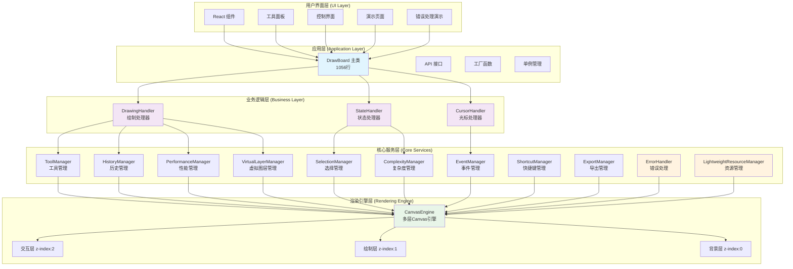

# DrawBoard 整体架构图

## 系统分层架构

这个图表展示了 DrawBoard 的五层架构设计，从用户界面到底层渲染引擎的完整技术栈。

## 架构特点

### 🎯 分层职责
- **用户界面层**: React 组件和用户交互界面
- **应用层**: DrawBoard 主类作为系统门面，单例管理
- **业务逻辑层**: 处理器模式，职责分离
- **核心服务层**: 10个专业管理器，功能完整
- **渲染引擎层**: 多层Canvas系统，性能优化

### 🏗️ 核心组件统计
- **总文件数**: 43个TypeScript文件
- **总代码行数**: 11,431行
- **核心类**: 1个主类 + 3个处理器 + 10个管理器
- **工具系统**: 完整的绘制工具链
- **错误处理**: 完善的错误处理和资源管理

### ⚡ 性能优化特性
- **多层Canvas**: 分离交互、绘制、背景层
- **预渲染缓存**: 智能缓存系统
- **内存管理**: 轻量级资源管理器
- **复杂度管理**: 自适应性能模式
- **事件节流**: 优化用户交互性能

### 🛡️ 稳定性保障
- **错误处理**: 统一的错误处理系统
- **资源管理**: 自动资源清理和泄漏检测
- **单例管理**: 防止重复实例化
- **类型安全**: 完整的TypeScript类型定义 