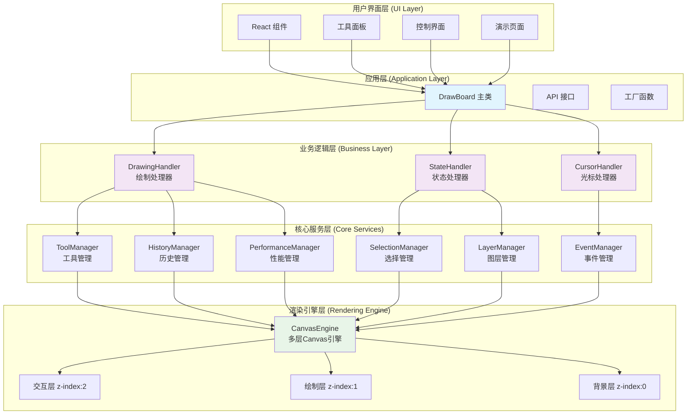

# DrawBoard 整体架构图

## 系统分层架构

这个图表展示了 DrawBoard 的五层架构设计，从用户界面到底层渲染引擎的完整技术栈。

## 架构特点

### 🎯 分层职责
- **用户界面层**: React 组件和用户交互界面
- **应用层**: DrawBoard 主类作为系统门面
- **业务逻辑层**: 处理器模式，职责分离
- **核心服务层**: 各种专业管理器
- **渲染引擎层**: 多层 Canvas 渲染系统

### ⚡ 设计优势
- **单向数据流**: 从上到下的清晰依赖关系
- **职责分离**: 每层专注特定功能
- **模块化**: 便于维护和扩展
- **高内聚低耦合**: 减少模块间依赖 