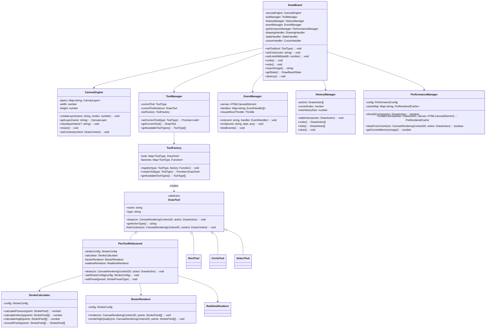

# DrawBoard 核心类图

## 系统核心类结构

这个类图展示了 DrawBoard 系统中核心类的结构、属性、方法以及它们之间的关系。

## 类关系说明

### 🎯 核心关系

#### 组合关系 (Composition)
- **DrawBoard** 组合了所有核心管理器
- **PenToolRefactored** 组合了运笔效果模块

#### 聚合关系 (Aggregation)  
- **ToolManager** 聚合 **ToolFactory**
- **ToolFactory** 管理 **DrawTool** 实例

#### 继承关系 (Inheritance)
- 所有具体工具继承自 **DrawTool** 抽象基类

#### 依赖关系 (Dependency)
- **ToolFactory** 创建并依赖 **DrawTool** 实例

### 🏗️ 设计模式体现

1. **门面模式**: DrawBoard 作为统一入口
2. **工厂模式**: ToolFactory 负责工具创建
3. **策略模式**: 多种渲染器可互换
4. **观察者模式**: EventManager 事件系统
5. **命令模式**: HistoryManager 命令历史

### ⚡ 架构优势

- **低耦合**: 模块间依赖关系清晰
- **高内聚**: 每个类职责单一
- **易扩展**: 支持新工具和渲染器
- **易测试**: 模块可独立测试 