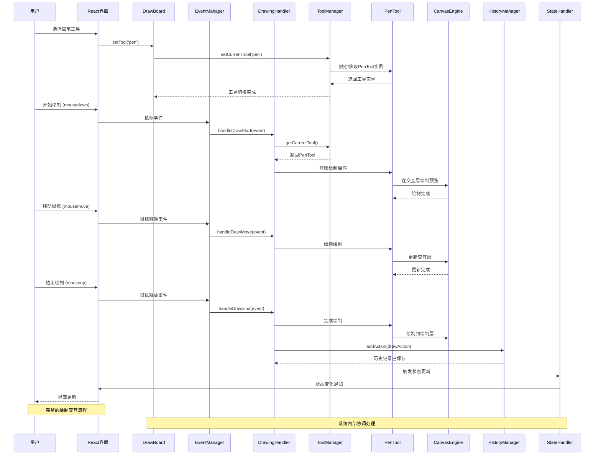

# DrawBoard 交互时序图

## 用户绘制操作完整流程

这个时序图展示了用户从选择工具到完成绘制的完整交互流程，包括系统内部各组件的协调过程。

## 时序说明

### 🎯 主要阶段

#### 1. 工具选择阶段
- 用户通过UI选择工具
- ToolManager负责工具切换
- 支持异步工具加载

#### 2. 绘制开始阶段  
- 捕获mousedown事件
- 激活对应绘制工具
- 在交互层开始预览

#### 3. 绘制进行阶段
- 持续处理mousemove事件
- 实时更新交互层内容
- 事件节流保证性能

#### 4. 绘制完成阶段
- 处理mouseup事件
- 将内容绘制到绘制层
- 保存到历史记录
- 更新系统状态

### ⚡ 性能优化

1. **事件节流**: mousemove事件被节流到16ms
2. **分层渲染**: 预览和最终结果分层处理  
3. **异步工具加载**: 工具按需加载，提升启动速度
4. **状态批量更新**: 避免频繁的UI重渲染

### 🔄 错误处理

- 每个阶段都有错误边界保护
- 工具切换失败时回退到默认工具
- 绘制异常时清理临时状态
- 历史记录保存失败时给出提示

### 📱 移动端适配

- 同时支持mouse和touch事件
- 事件坐标自动适配不同设备
- 触摸压感和手势识别
- 防误触机制 