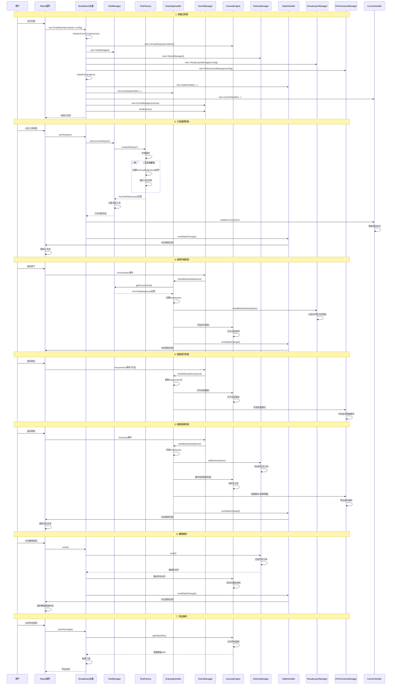

# DrawBoard 交互时序图

## 用户交互流程

这个时序图展示了用户从选择工具到完成绘制的完整交互流程，以及系统内部组件的协调过程。

## 交互流程说明

### 🎯 关键阶段

#### 1. **初始化阶段**
- **单例管理**: DrawBoard使用WeakMap管理实例
- **组件初始化**: 按依赖顺序初始化各个组件
- **事件绑定**: 绑定鼠标、触摸等输入事件
- **错误处理**: 完善的初始化错误处理机制

#### 2. **工具选择阶段**
- **懒加载**: 工具按需创建和缓存
- **状态同步**: 工具切换时同步更新UI状态
- **光标更新**: 根据工具类型更新鼠标样式
- **性能优化**: 工具预加载机制

#### 3. **绘制开始阶段**
- **事件处理**: 统一的事件处理机制
- **图层管理**: 动作分配到虚拟图层
- **实时反馈**: 在交互层实时绘制
- **状态通知**: 及时通知状态变化

#### 4. **绘制进行阶段**
- **事件节流**: 优化鼠标移动事件处理
- **实时更新**: 持续更新绘制内容
- **性能监控**: 实时监控性能状态
- **缓存策略**: 智能缓存决策

#### 5. **绘制结束阶段**
- **历史记录**: 添加到撤销/重做历史
- **最终绘制**: 绘制到持久层
- **缓存创建**: 创建预渲染缓存
- **状态同步**: 更新所有相关状态

#### 6. **撤销操作**
- **历史管理**: 完整的历史记录系统
- **重绘机制**: 高效的重绘策略
- **状态恢复**: 准确的状态恢复
- **性能优化**: 优化的重绘性能

#### 7. **导出操作**
- **图层合并**: 智能的图层合并策略
- **格式支持**: 多种导出格式
- **质量控制**: 可配置的导出质量
- **用户体验**: 流畅的导出体验

### ⚡ 性能优化点

1. **事件节流**: 鼠标移动事件节流处理
2. **分层渲染**: 交互层和绘制层分离
3. **预渲染缓存**: 智能缓存复杂绘制内容
4. **懒加载**: 工具和资源按需加载
5. **状态管理**: 高效的状态更新机制

### 🛡️ 稳定性保障

1. **错误处理**: 每个阶段都有错误处理
2. **资源管理**: 自动资源清理和泄漏检测
3. **状态同步**: 确保状态一致性
4. **性能监控**: 实时性能监控和调整 