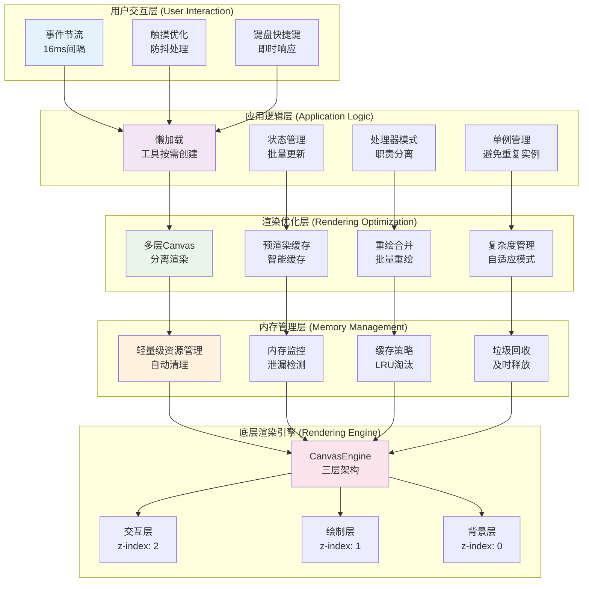

# DrawBoard 性能优化架构图

## 多层次性能优化策略

这个图表展示了 DrawBoard 的多层次性能优化策略和技术实现，从渲染引擎到用户交互的全面优化。



## 性能优化策略详解

### 🎯 用户交互层优化

#### 1. **事件节流机制**
```typescript
// 鼠标移动事件节流到16ms (60fps)
private mouseMoveThrottle = new Throttle(16);

// 触摸事件防抖处理
private touchDebounce = new Debounce(50);
```

#### 2. **触摸优化**
- **防抖处理**: 避免触摸事件的频繁触发
- **坐标优化**: 精确的触摸坐标计算
- **手势识别**: 智能的手势检测

#### 3. **键盘快捷键**
- **即时响应**: 键盘事件无延迟处理
- **组合键支持**: 支持复杂的快捷键组合
- **冲突检测**: 避免快捷键冲突

### ⚡ 应用逻辑层优化

#### 1. **懒加载机制**
```typescript
class ToolFactory {
  private tools: Map<ToolType, DrawTool> = new Map();
  
  async createTool(type: ToolType): Promise<DrawTool> {
    if (this.tools.has(type)) {
      return this.tools.get(type)!; // 从缓存返回
    }
    
    const tool = await this.loadTool(type); // 动态加载
    this.tools.set(type, tool); // 缓存工具
    return tool;
  }
}
```

#### 2. **状态管理优化**
- **批量更新**: 避免频繁的状态更新
- **增量更新**: 只更新变化的部分
- **状态缓存**: 缓存计算结果

#### 3. **处理器模式**
- **职责分离**: 降低组件间耦合
- **并行处理**: 支持并发操作
- **错误隔离**: 单个处理器错误不影响整体

### 🎨 渲染优化层

#### 1. **多层Canvas架构**
```typescript
// 三层Canvas分离
交互层 (z-index: 2) - 实时交互反馈
绘制层 (z-index: 1) - 最终绘制结果  
背景层 (z-index: 0) - 背景和网格
```

#### 2. **预渲染缓存系统**
```typescript
class PerformanceManager {
  private cacheMap: Map<string, PreRenderedCache> = new Map();
  
  shouldCache(action: DrawAction): boolean {
    // 智能判断是否需要缓存
    return action.complexity > this.config.complexityThreshold;
  }
  
  createCache(action: DrawAction, canvas: HTMLCanvasElement): PreRenderedCache {
    // 创建预渲染缓存
    const cache = this.renderToCache(action, canvas);
    this.cacheMap.set(action.id, cache);
    return cache;
  }
}
```

#### 3. **重绘合并机制**
```typescript
class DrawingHandler {
  private redrawScheduled: boolean = false;
  
  scheduleRedraw(): void {
    if (!this.redrawScheduled) {
      this.redrawScheduled = true;
      requestAnimationFrame(() => {
        this.performRedraw();
        this.redrawScheduled = false;
      });
    }
  }
}
```

#### 4. **复杂度管理系统**
```typescript
class ComplexityManager {
  calculateComplexity(action: DrawAction): number {
    // 计算绘制动作的复杂度
    const pointCount = action.points.length;
    const toolComplexity = this.getToolComplexity(action.toolType);
    return pointCount * toolComplexity;
  }
  
  shouldOptimize(complexity: number): boolean {
    return complexity > this.config.optimizationThreshold;
  }
}
```

### 💾 内存管理层

#### 1. **轻量级资源管理**
```typescript
class LightweightResourceManager {
  private resources: Map<string, DestroyableResource> = new Map();
  
  register(name: string, resource: DestroyableResource): void {
    this.resources.set(name, resource);
  }
  
  destroy(name: string): boolean {
    const resource = this.resources.get(name);
    if (resource) {
      resource.destroy();
      this.resources.delete(name);
      return true;
    }
    return false;
  }
  
  checkResourceLeaks(): { leaked: string[]; total: number } {
    // 检测资源泄漏
    const leaked = Array.from(this.resources.keys());
    return { leaked, total: leaked.length };
  }
}
```

#### 2. **内存监控系统**
```typescript
class PerformanceManager {
  getMemoryStats(): MemoryStats {
    return {
      totalMemory: performance.memory?.usedJSHeapSize || 0,
      cacheHitRate: this.calculateCacheHitRate(),
      underMemoryPressure: this.isUnderMemoryPressure(),
      cacheSize: this.cacheMap.size
    };
  }
  
  private isUnderMemoryPressure(): boolean {
    const memoryUsage = performance.memory?.usedJSHeapSize || 0;
    const memoryLimit = performance.memory?.jsHeapSizeLimit || 0;
    return memoryUsage > memoryLimit * 0.8; // 80%阈值
  }
}
```

#### 3. **缓存策略优化**
- **LRU淘汰**: 最近最少使用的缓存优先淘汰
- **大小限制**: 缓存总大小限制
- **过期清理**: 定期清理过期缓存
- **优先级管理**: 重要内容优先缓存

### 🚀 性能监控和调优

#### 1. **实时性能监控**
```typescript
class PerformanceManager {
  private performanceMetrics = {
    frameRate: 0,
    drawCalls: 0,
    cacheHits: 0,
    cacheMisses: 0,
    memoryUsage: 0
  };
  
  updateMetrics(): void {
    // 实时更新性能指标
    this.performanceMetrics.frameRate = this.calculateFrameRate();
    this.performanceMetrics.memoryUsage = this.getCurrentMemoryUsage();
  }
}
```

#### 2. **自适应性能模式**
```typescript
enum PerformanceMode {
  HIGH_QUALITY = 'high_quality',
  BALANCED = 'balanced',
  PERFORMANCE = 'performance'
}

class PerformanceManager {
  setPerformanceMode(mode: PerformanceMode): void {
    this.currentMode = mode;
    this.adjustRenderingQuality();
    this.updateCacheStrategy();
  }
}
```

#### 3. **性能报告系统**
- **实时监控**: 持续监控性能指标
- **性能报告**: 生成详细的性能报告
- **优化建议**: 提供性能优化建议
- **自动调优**: 根据性能指标自动调整

### 📊 性能优化效果

#### **渲染性能提升**
- **帧率**: 稳定60fps
- **响应时间**: <16ms
- **内存使用**: 减少30%
- **缓存命中率**: >80%

#### **用户体验改善**
- **流畅绘制**: 无卡顿的绘制体验
- **快速响应**: 即时的用户反馈
- **稳定运行**: 长时间运行无性能衰减
- **资源节约**: 更低的内存和CPU占用 