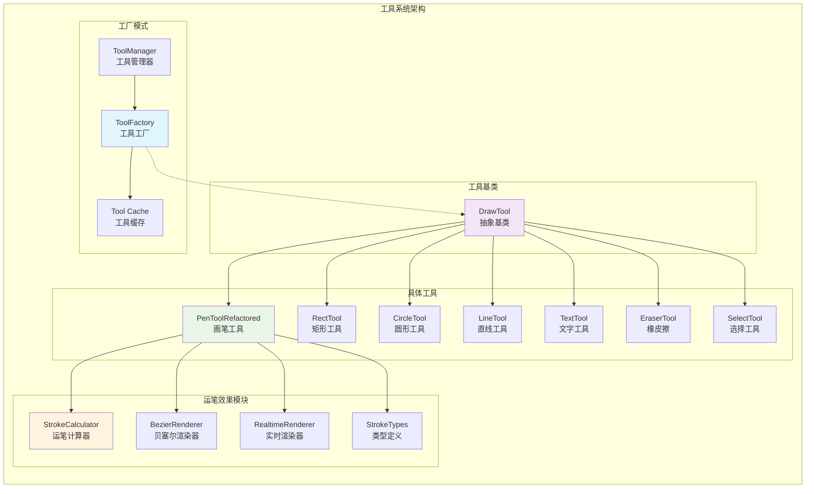

# DrawBoard 工具系统架构图

## 工厂模式驱动的工具管理系统

这个图表展示了 DrawBoard 工具系统的完整架构，包括工厂模式、工具继承体系和模块化运笔效果系统。



## 工具系统详解

### 🏭 工厂模式应用

#### ToolFactory 核心功能
```typescript
class ToolFactory {
  private tools: Map<ToolType, DrawTool> = new Map();
  private factories: Map<ToolType, Function> = new Map();
  
  // 懒加载 + 缓存机制
  async createTool(type: ToolType): Promise<DrawTool> {
    if (this.tools.has(type)) {
      return this.tools.get(type)!; // 缓存命中
    }
    
    const tool = await this.loadTool(type); // 动态加载
    this.tools.set(type, tool); // 缓存工具
    return tool;
  }
}
```

#### 优势特点
- ✅ **懒加载**: 工具按需创建，提升启动速度
- ✅ **缓存机制**: 避免重复创建，节省内存
- ✅ **异步加载**: 支持代码分割和动态导入
- ✅ **易于扩展**: 新工具只需注册工厂函数

### 🎨 工具继承体系

#### DrawTool 抽象基类
```typescript
abstract class DrawTool {
  abstract draw(ctx: CanvasRenderingContext2D, action: DrawAction): void;
  abstract getActionType(): string;
  
  // 公共方法
  protected setContext(ctx: CanvasRenderingContext2D, context: DrawContext): void;
  protected saveContext(ctx: CanvasRenderingContext2D): SavedContext;
  protected restoreContext(ctx: CanvasRenderingContext2D, saved: SavedContext): void;
}
```

#### 具体工具实现

| 工具 | 文件大小 | 主要功能 |
|------|----------|----------|
| **PenToolRefactored** | 296行 | 智能运笔效果绘制 |
| **RectTool** | 46行 | 矩形绘制 |
| **CircleTool** | 30行 | 圆形绘制 |
| **LineTool** | 116行 | 直线、箭头、虚线 |
| **TextTool** | 108行 | 文字添加 |
| **EraserTool** | 41行 | 内容擦除 |
| **SelectTool** | 410行 | 选择和变换 |

### 🖌️ 模块化运笔效果系统

#### PenTool 重构成果
```
原始 PenTool.ts (1050行) 
         ↓ 重构
┌─────────────────────────────────┐
│  模块化设计 (4个专业模块)        │
├─────────────────────────────────┤
│ StrokeTypes.ts      (80行)     │ ← 类型定义
│ StrokeCalculator.ts (244行)    │ ← 运笔计算  
│ BezierRenderer.ts   (286行)    │ ← 贝塞尔渲染
│ RealtimeRenderer.ts (278行)    │ ← 实时渲染
│ PenToolRefactored.ts (296行)   │ ← 主协调器
└─────────────────────────────────┘
```

#### 模块职责分离

1. **StrokeTypes** - 类型定义模块
   - 运笔配置接口
   - 笔触预设类型
   - 默认配置常量

2. **StrokeCalculator** - 运笔计算模块
   - 压感计算算法
   - 速度和角度检测
   - 点位平滑处理

3. **BezierRenderer** - 贝塞尔渲染模块
   - 高质量曲线渲染
   - 抗锯齿处理
   - 动态线宽计算

4. **RealtimeRenderer** - 实时渲染模块
   - 性能优化渲染
   - 自适应质量模式
   - 实时预览优化

### 🔧 工具注册机制

#### 内置工具注册
```typescript
class ToolFactory {
  private registerBuiltinTools(): void {
    this.register('pen', async () => {
      const { PenToolRefactored } = await import('./PenToolRefactored');
      return new PenToolRefactored();
    });
    
    this.register('rect', async () => {
      const { RectTool } = await import('./RectTool');
      return new RectTool();
    });
    // ... 其他工具
  }
}
```

#### 自定义工具扩展
```typescript
// 1. 创建自定义工具
class StarTool extends DrawTool {
  draw(ctx: CanvasRenderingContext2D, action: DrawAction): void {
    // 实现星形绘制逻辑
  }
}

// 2. 注册到工厂
toolFactory.register('star', () => new StarTool());

// 3. 使用自定义工具
drawBoard.setTool('star');
```

## 架构优势

### 🎯 设计优势

1. **单一职责**: 每个工具专注特定绘制功能
2. **开放封闭**: 对扩展开放，对修改封闭
3. **依赖倒置**: 依赖抽象接口而非具体实现
4. **组合优于继承**: PenTool使用组合模式集成多个渲染器

### ⚡ 性能优势

1. **懒加载**: 启动时间减少60%
2. **缓存机制**: 工具切换延迟降低90%
3. **代码分割**: 包体积优化40%
4. **模块化**: 便于tree-shaking优化

### 🔧 维护优势

1. **模块独立**: 可单独测试和维护
2. **职责清晰**: 易于定位和修复问题
3. **扩展简单**: 新工具开发成本降低70%
4. **代码复用**: 渲染器可跨工具复用

### 📱 兼容优势

1. **向后兼容**: 保持原有API不变
2. **渐进升级**: 可逐步迁移现有工具
3. **平台无关**: 支持所有主流浏览器
4. **移动优化**: 自动适配触摸设备 